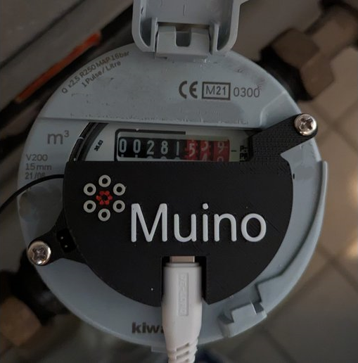

# Muino Water-Meter Reader - sub-100 millilitre precision



[Online Water Meter Programmer](https://martijnvwezel.github.io/watermeter-esphome/) | [Webshop](https://muino.nl/product/smart-water-meter-reader) | [Unsupported sensors](https://github.com/martijnvwezel/watermeter-esphome/wiki) | [Releases](https://github.com/martijnvwezel/watermeter-esphome/releases)

Water meters are devices that measure how much water you use. They have a spinning disk inside them, and each time it spins all the way around, it means you've used one liter of water. Most water meter readers use a simple method: they check if a metal disk is there or not. But the Muino water meter is different. It uses three light sensors to keep track of where the disk is. It uses some smart techniques to do this, and we use calculate with some fine adjustments to get things just right. This helps the Muino water meter measure very accurately, down to almost a millimeter. But remember, the spinning disk doesn't move perfectly like a smooth wave. So, in some parts of its rotation, the measurements might jump a bit more than in other parts.

## Why

The Muino Smart Water Meter is a **single-board** device that measures water consumption with **sub-100 millilitre** accuracy. The other big benefit is the **ease of installation**, for friends/family that wanted a similar solution this is easier to use.

## Confirmed supported devices

* KiWa V200 (Designed for)
* Honeywell v200 (Designed for)
* KiWa R400 (Similar to Sensus 620)
* Sensus 620 (Note: Placement might appear less aesthetically pleasing because of the meters placement. The two middle holes of the Muino reader are aligned over the meter for proper attachment.)
* Elster Honeywell (some)
* Itron Actaris Schlumberger (Aquadis+) with double-sided tape or tie-wraps.
* You can always donate to let me create a watermeter compatibility..

Is your meter not listed or stubborn? Check the [Unsupported sensors steps](https://github.com/martijnvwezel/watermeter-esphome/wiki).

## Where to buy?

* If you would like the watermeter go to: [tindie-webshop](https://www.tindie.com/products/muino/smart-water-meter-reader/) or better my [own-webshop](https://muino.nl/product/smart-water-meter-reader)
* You want a sensor to play with the DIY version go to: [tindie-webshop](https://www.tindie.com/products/muino/3-phase-muino-light-sensor-encoder/) or better my [own-webshop](https://muino.nl/product/3d-case-for-the-water-meter-reader)
* For big orders please make a request: [email](mailto:martijnvwezel@muino.nl)
* My webshop is located at [muino.nl](https://muino.nl). I haven't dedicated time to enhancing the visual appeal of my site. However, I prefer nowadays my own website, because some people just buy it without knowing what they buy and using Tindie's protection scheme let me pay for all of the shipping costs. So in the end I am wrong and therefore I request a higher price from tindie webshop than from my own webshop, sorry I have to.

## Installation

Thank you for buying the Muino Water Meter Reader :). Let me try to explain the steps for your installation!

### What do you need

* USB-C cable that can power the Muino Smart Water Meter
* Device with WiFi for initial connection to your home wifi network
* Access to your Home-assistant

### Installation steps

1. Place the Muino Smart Water Meter on your water-meter, where applicable use M2.5/M4 screws/bolts to attach.
   Screws are intended to fit securely/snuggly in the PCB but *do not* over tighten. Less compatible meters have no or wrong mounting holes, use tie-wraps, tape and creativity...
2. Connect the USB-C power
3. Go to your phone/wifi-device and connect to the Muino Smart Water Meter WiFi SSID (if you need a password: `12345678`)
4. Once the device connected to the Muino Smart Water Meter, go to http://192.168.4.1 and select your preferred WiFi SSID to connect the Muino Smart Water Meter with and enter the SSID passcode.
5. The Muino Smart Water Meter will try to connect to the selected WiFi SSID, please be patient. After a while, check your home network to find the IP-address of the Espressif Muino Smart Water Meter.
6. In Home Assistant, go to Settings, add the ESPHome integration, and add IP-address of the Muino Smart Water Meter to adopt it.
7. In Home Assistant, go to Energy -> Energy Configuration (3 dot menu), add the new sensor (sensor.liters) and potentially the price per cubic meter of water.

**Don't forget to Add Muino Water-Meter Reader to your HA Energy-dashboard**

## Water Sensor Update Protocol

1. **After restart**: Upon restart, a zero value is sent to inform the home assistant that the sensor has been reset.
2. **Calibration**: The sensor calibrates during the first 2 liters of water usage.
3. **Sending Updates**: After calibration, the sensor sends updates to the home assistant system. It waits until it detects 2 liters of water usage and then pauses for 1 minute before sending the update. This prevents interruptions during activities like showering.
4. **Speed modus**: For faster updating the live values from the watermeter, what is more noisy and fills the database of your home-assistant.
5. **Debug modus**: The speed modus will be enabled and the debug json will be filled with values from the meter for debugging purpose only.

## Update your watermeter with a clean binary

You can use the [Online Water Meter Programmer](https://martijnvwezel.github.io/watermeter-esphome/) to install the pre-built firmware directly to your device via USB from the browser. Release notes are on the [Releases](https://github.com/martijnvwezel/watermeter-esphome/releases) page.

## Pro-user & Development

```bash
docker run --rm --privileged -v  ${PWD}:/config   -it ghcr.io/esphome/esphome run  --device=/dev/ttyACM0 "muino-water-meter-esp32.yaml"
```

### For Windows

```bash
# for windows builds are done using WSL
# Open following in admin powershell
usbipd wsl list

# select  the one to connect
usbipd wsl attach --busid <busid>
```

## Support

[](https://www.buymeacoffee.com/muino)
